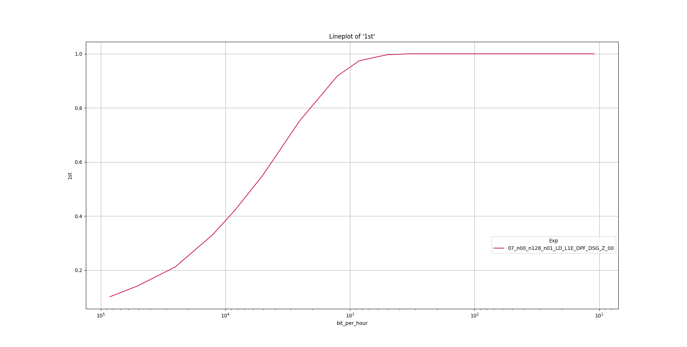

# Experiment 3
This experiments demonstrates CPA on the raw channel with and without amplification.

## Preliminary
Follow the preliminary steps of this [README.md](../README.md).

## How to Run
Execute the following command and let the script run for approximately 10 hours.

```
./run_e3.sh log.csv
```

## How to Analyze

Execute the following command to analyze the results.
```
./pp_e3.sh log.csv
```

To increase the sampling precision in the plot an optional parameter (default=100) can be specified.

Execute the following command to analyze the results with a higher *resolution*.
```
./pp_e3.sh log.csv 1000
```

## Example output
The example output for the `pp_e3.sh` script.

The resulting plot:



The resulting console output:
```
> --print 
                   1st       2nd       3rd  bit_per_minute                                  Exp  _
bit_per_hour                                                                                      
84302.362231  0.092500  0.178125  0.266250     1405.039371  07_n00_n128_n01_LD_L1E_DPF_DSG_Z_00  1
50581.417338  0.150625  0.257500  0.347500      843.023622  07_n00_n128_n01_LD_L1E_DPF_DSG_Z_00  1
25290.708669  0.203750  0.358125  0.471250      421.511811  07_n00_n128_n01_LD_L1E_DPF_DSG_Z_00  1
12645.354335  0.300000  0.467500  0.605625      210.755906  07_n00_n128_n01_LD_L1E_DPF_DSG_Z_00  1
8430.236223   0.366875  0.556875  0.686250      140.503937  07_n00_n128_n01_LD_L1E_DPF_DSG_Z_00  1
5058.141734   0.509375  0.693750  0.800000       84.302362  07_n00_n128_n01_LD_L1E_DPF_DSG_Z_00  1
2529.070867   0.715000  0.868750  0.926875       42.151181  07_n00_n128_n01_LD_L1E_DPF_DSG_Z_00  1
1264.535433   0.890000  0.963125  0.987500       21.075591  07_n00_n128_n01_LD_L1E_DPF_DSG_Z_00  1
843.023622    0.953125  0.985625  0.993750       14.050394  07_n00_n128_n01_LD_L1E_DPF_DSG_Z_00  1
505.814173    0.991875  0.996875  1.000000        8.430236  07_n00_n128_n01_LD_L1E_DPF_DSG_Z_00  1
337.209449    0.996250  0.998125  1.000000        5.620157  07_n00_n128_n01_LD_L1E_DPF_DSG_Z_00  1
252.907087    0.997500  0.999375  1.000000        4.215118  07_n00_n128_n01_LD_L1E_DPF_DSG_Z_00  1
126.453543    1.000000  1.000000  1.000000        2.107559  07_n00_n128_n01_LD_L1E_DPF_DSG_Z_00  1
84.302362     1.000000  1.000000  1.000000        1.405039  07_n00_n128_n01_LD_L1E_DPF_DSG_Z_00  1
50.581417     1.000000  1.000000  1.000000        0.843024  07_n00_n128_n01_LD_L1E_DPF_DSG_Z_00  1
25.290709     1.000000  1.000000  1.000000        0.421512  07_n00_n128_n01_LD_L1E_DPF_DSG_Z_00  1
21.075591     1.000000  1.000000  1.000000        0.351260  07_n00_n128_n01_LD_L1E_DPF_DSG_Z_00  1
19.454391     1.000000  1.000000  1.000000        0.324240  07_n00_n128_n01_LD_L1E_DPF_DSG_Z_00  1
16.860472     1.000000  1.000000  1.000000        0.281008  07_n00_n128_n01_LD_L1E_DPF_DSG_Z_00  1
12.645354     1.000000  1.000000  1.000000        0.210756  07_n00_n128_n01_LD_L1E_DPF_DSG_Z_00  1
10.995960     1.000000  1.000000  1.000000        0.183266  07_n00_n128_n01_LD_L1E_DPF_DSG_Z_00  1
```
