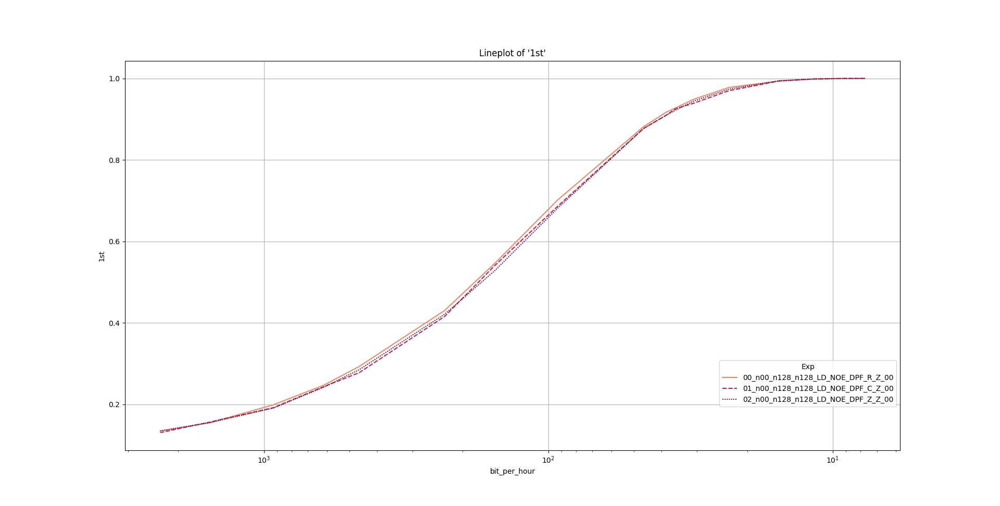

# Experiment 4
This experiments demonstrates that the filling values (the unmasked data) does not influence the CPA.

## Preliminary
Follow the preliminary steps of this [README.md](../README.md).

## How to Run
Execute the following command and let the script run for approximately 10 hours.

```
./run_e4.sh log.csv
```

## How to Analyze

Execute the following command to analyze the results.
```
./pp_e4.sh log.csv
```

To increase the sampling precision in the plot an optional parameter (default=100) can be specified.

Execute the following command to analyze the results with a higher *resolution*.
```
./pp_e4.sh log.csv 1000
```

## Example output
The example output for the `pp_e4.sh` script.

The resulting plot:



The resulting console output:
```
                   1st       2nd       3rd  bit_per_minute                                 Exp  _
bit_per_hour                                                                                     
2315.711505   0.134929  0.258286  0.357714       38.595192  00_n00_n128_n128_LD_NOE_DPF_R_Z_00  1
1543.807670   0.155286  0.293357  0.403929       25.730128  00_n00_n128_n128_LD_NOE_DPF_R_Z_00  1
926.284602    0.199071  0.352214  0.465214       15.438077  00_n00_n128_n128_LD_NOE_DPF_R_Z_00  1
617.523068    0.246857  0.429357  0.549500       10.292051  00_n00_n128_n128_LD_NOE_DPF_R_Z_00  1
463.142301    0.292857  0.487929  0.607429        7.719038  00_n00_n128_n128_LD_NOE_DPF_R_Z_00  1
231.571150    0.430571  0.654500  0.762786        3.859519  00_n00_n128_n128_LD_NOE_DPF_R_Z_00  1
154.380767    0.546143  0.765714  0.847429        2.573013  00_n00_n128_n128_LD_NOE_DPF_R_Z_00  1
92.628460     0.702071  0.883000  0.932929        1.543808  00_n00_n128_n128_LD_NOE_DPF_R_Z_00  1
46.314230     0.881357  0.972357  0.987000        0.771904  00_n00_n128_n128_LD_NOE_DPF_R_Z_00  1
38.595192     0.916857  0.982929  0.993143        0.643253  00_n00_n128_n128_LD_NOE_DPF_R_Z_00  1
35.626331     0.928000  0.984857  0.993857        0.593772  00_n00_n128_n128_LD_NOE_DPF_R_Z_00  1
30.876153     0.948714  0.990143  0.996286        0.514603  00_n00_n128_n128_LD_NOE_DPF_R_Z_00  1
23.157115     0.978000  0.997000  0.998500        0.385952  00_n00_n128_n128_LD_NOE_DPF_R_Z_00  1
15.438077     0.993429  0.999643  0.999929        0.257301  00_n00_n128_n128_LD_NOE_DPF_R_Z_00  1
11.578558     0.998643  1.000000  1.000000        0.192976  00_n00_n128_n128_LD_NOE_DPF_R_Z_00  1
9.262846      0.999429  1.000000  1.000000        0.154381  00_n00_n128_n128_LD_NOE_DPF_R_Z_00  1
7.719038      0.999714  1.000000  1.000000        0.128651  00_n00_n128_n128_LD_NOE_DPF_R_Z_00  1
2315.710838   0.130714  0.251357  0.352143       38.595181  01_n00_n128_n128_LD_NOE_DPF_C_Z_00  1
1543.807225   0.156929  0.295714  0.405500       25.730120  01_n00_n128_n128_LD_NOE_DPF_C_Z_00  1
926.284335    0.192000  0.352357  0.464643       15.438072  01_n00_n128_n128_LD_NOE_DPF_C_Z_00  1
617.522890    0.243286  0.422286  0.543929       10.292048  01_n00_n128_n128_LD_NOE_DPF_C_Z_00  1
463.142168    0.277714  0.475357  0.594286        7.719036  01_n00_n128_n128_LD_NOE_DPF_C_Z_00  1
231.571084    0.415857  0.642071  0.752143        3.859518  01_n00_n128_n128_LD_NOE_DPF_C_Z_00  1
154.380723    0.540643  0.763714  0.847214        2.573012  01_n00_n128_n128_LD_NOE_DPF_C_Z_00  1
92.628434     0.686643  0.877000  0.932286        1.543807  01_n00_n128_n128_LD_NOE_DPF_C_Z_00  1
46.314217     0.877071  0.973500  0.990143        0.771904  01_n00_n128_n128_LD_NOE_DPF_C_Z_00  1
38.595181     0.909214  0.985214  0.995429        0.643253  01_n00_n128_n128_LD_NOE_DPF_C_Z_00  1
35.626321     0.926071  0.988429  0.996429        0.593772  01_n00_n128_n128_LD_NOE_DPF_C_Z_00  1
30.876145     0.939071  0.992714  0.998000        0.514602  01_n00_n128_n128_LD_NOE_DPF_C_Z_00  1
23.157108     0.970000  0.997571  0.999500        0.385952  01_n00_n128_n128_LD_NOE_DPF_C_Z_00  1
15.438072     0.993786  0.999857  0.999929        0.257301  01_n00_n128_n128_LD_NOE_DPF_C_Z_00  1
11.578554     0.998929  1.000000  1.000000        0.192976  01_n00_n128_n128_LD_NOE_DPF_C_Z_00  1
9.262843      1.000000  1.000000  1.000000        0.154381  01_n00_n128_n128_LD_NOE_DPF_C_Z_00  1
7.719036      1.000000  1.000000  1.000000        0.128651  01_n00_n128_n128_LD_NOE_DPF_C_Z_00  1
2315.711809   0.134786  0.255000  0.349857       38.595197  02_n00_n128_n128_LD_NOE_DPF_Z_Z_00  1
1543.807872   0.155571  0.292143  0.394786       25.730131  02_n00_n128_n128_LD_NOE_DPF_Z_Z_00  1
926.284723    0.191000  0.349714  0.464357       15.438079  02_n00_n128_n128_LD_NOE_DPF_Z_Z_00  1
617.523149    0.242000  0.423429  0.541786       10.292052  02_n00_n128_n128_LD_NOE_DPF_Z_Z_00  1
463.142362    0.284857  0.486929  0.601214        7.719039  02_n00_n128_n128_LD_NOE_DPF_Z_Z_00  1
231.571181    0.421357  0.649000  0.752929        3.859520  02_n00_n128_n128_LD_NOE_DPF_Z_Z_00  1
154.380787    0.528143  0.750286  0.840500        2.573013  02_n00_n128_n128_LD_NOE_DPF_Z_Z_00  1
92.628472     0.682000  0.873429  0.929571        1.543808  02_n00_n128_n128_LD_NOE_DPF_Z_Z_00  1
46.314236     0.876786  0.974571  0.990571        0.771904  02_n00_n128_n128_LD_NOE_DPF_Z_Z_00  1
38.595197     0.909357  0.985714  0.994857        0.643253  02_n00_n128_n128_LD_NOE_DPF_Z_Z_00  1
35.626336     0.922571  0.988500  0.995929        0.593772  02_n00_n128_n128_LD_NOE_DPF_Z_Z_00  1
30.876157     0.944143  0.993714  0.997857        0.514603  02_n00_n128_n128_LD_NOE_DPF_Z_Z_00  1
23.157118     0.973929  0.998643  0.999857        0.385952  02_n00_n128_n128_LD_NOE_DPF_Z_Z_00  1
15.438079     0.994429  0.999786  1.000000        0.257301  02_n00_n128_n128_LD_NOE_DPF_Z_Z_00  1
11.578559     0.998714  1.000000  1.000000        0.192976  02_n00_n128_n128_LD_NOE_DPF_Z_Z_00  1
9.262847      1.000000  1.000000  1.000000        0.154381  02_n00_n128_n128_LD_NOE_DPF_Z_Z_00  1
7.719039      1.000000  1.000000  1.000000        0.128651  02_n00_n128_n128_LD_NOE_DPF_Z_Z_00  1
```
