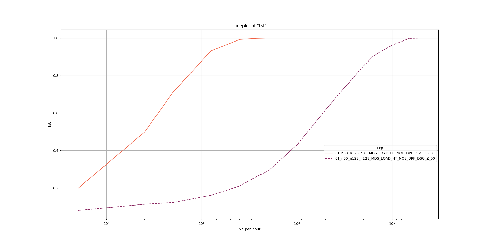

# Experiment 5
This experiments demonstrates MDS-Power leaking data actively being used from the hyperthread.

## Preliminary
Follow the preliminary steps of this [README.md](../README.md).

## How to Run
Execute the following command and let the script run for approximately 10 hours.

```
./run_e5.sh log.csv
```

## How to Analyze

Execute the following command to analyze the results.
```
./pp_e5.sh log.csv
```

To increase the sampling precision in the plot an optional parameter (default=100) can be specified.

Execute the following command to analyze the results with a higher *resolution*.
```
./pp_e5.sh log.csv 1000
```

## Example output
The example output for the `pp_e5.sh` script.

The resulting plot:



The resulting console output:
```
> --print 
                  1st      2nd      3rd  bit_per_minute                                            Exp  _
bit_per_hour                                                                                             
19834.340768  0.19750  0.35300  0.46525      330.572346   01_n00_n128_n01_MDS_LOAD_HT_NOE_DPF_DSG_Z_00  1
3966.868154   0.49825  0.70550  0.78725       66.114469   01_n00_n128_n01_MDS_LOAD_HT_NOE_DPF_DSG_Z_00  1
1983.434077   0.71275  0.87325  0.92525       33.057235   01_n00_n128_n01_MDS_LOAD_HT_NOE_DPF_DSG_Z_00  1
793.373631    0.93275  0.97875  0.99250       13.222894   01_n00_n128_n01_MDS_LOAD_HT_NOE_DPF_DSG_Z_00  1
396.686815    0.99300  0.99850  1.00000        6.611447   01_n00_n128_n01_MDS_LOAD_HT_NOE_DPF_DSG_Z_00  1
264.457877    0.99850  0.99975  1.00000        4.407631   01_n00_n128_n01_MDS_LOAD_HT_NOE_DPF_DSG_Z_00  1
198.343408    1.00000  1.00000  1.00000        3.305723   01_n00_n128_n01_MDS_LOAD_HT_NOE_DPF_DSG_Z_00  1
99.171704     1.00000  1.00000  1.00000        1.652862   01_n00_n128_n01_MDS_LOAD_HT_NOE_DPF_DSG_Z_00  1
39.668682     1.00000  1.00000  1.00000        0.661145   01_n00_n128_n01_MDS_LOAD_HT_NOE_DPF_DSG_Z_00  1
19.834341     1.00000  1.00000  1.00000        0.330572   01_n00_n128_n01_MDS_LOAD_HT_NOE_DPF_DSG_Z_00  1
15.867473     1.00000  1.00000  1.00000        0.264458   01_n00_n128_n01_MDS_LOAD_HT_NOE_DPF_DSG_Z_00  1
13.222894     1.00000  1.00000  1.00000        0.220382   01_n00_n128_n01_MDS_LOAD_HT_NOE_DPF_DSG_Z_00  1
9.917170      1.00000  1.00000  1.00000        0.165286   01_n00_n128_n01_MDS_LOAD_HT_NOE_DPF_DSG_Z_00  1
6.611447      1.00000  1.00000  1.00000        0.110191   01_n00_n128_n01_MDS_LOAD_HT_NOE_DPF_DSG_Z_00  1
4.958585      1.00000  1.00000  1.00000        0.082643   01_n00_n128_n01_MDS_LOAD_HT_NOE_DPF_DSG_Z_00  1
19838.687546  0.07975  0.16525  0.24450      330.644792  01_n00_n128_n128_MDS_LOAD_HT_NOE_DPF_DSG_Z_00  1
3967.737509   0.11225  0.21500  0.29700       66.128958  01_n00_n128_n128_MDS_LOAD_HT_NOE_DPF_DSG_Z_00  1
1983.868755   0.12125  0.23300  0.31525       33.064479  01_n00_n128_n128_MDS_LOAD_HT_NOE_DPF_DSG_Z_00  1
793.547502    0.16025  0.29050  0.38825       13.225792  01_n00_n128_n128_MDS_LOAD_HT_NOE_DPF_DSG_Z_00  1
396.773751    0.21050  0.36850  0.47450        6.612896  01_n00_n128_n128_MDS_LOAD_HT_NOE_DPF_DSG_Z_00  1
264.515834    0.26000  0.44200  0.54875        4.408597  01_n00_n128_n128_MDS_LOAD_HT_NOE_DPF_DSG_Z_00  1
198.386875    0.29175  0.47850  0.59375        3.306448  01_n00_n128_n128_MDS_LOAD_HT_NOE_DPF_DSG_Z_00  1
99.193438     0.43100  0.64075  0.73475        1.653224  01_n00_n128_n128_MDS_LOAD_HT_NOE_DPF_DSG_Z_00  1
39.677375     0.67850  0.84475  0.89900        0.661290  01_n00_n128_n128_MDS_LOAD_HT_NOE_DPF_DSG_Z_00  1
19.838688     0.85250  0.95300  0.97000        0.330645  01_n00_n128_n128_MDS_LOAD_HT_NOE_DPF_DSG_Z_00  1
15.870950     0.90250  0.98125  0.98975        0.264516  01_n00_n128_n128_MDS_LOAD_HT_NOE_DPF_DSG_Z_00  1
13.225792     0.92825  0.98975  0.99475        0.220430  01_n00_n128_n128_MDS_LOAD_HT_NOE_DPF_DSG_Z_00  1
9.919344      0.96350  0.99675  0.99825        0.165322  01_n00_n128_n128_MDS_LOAD_HT_NOE_DPF_DSG_Z_00  1
6.612896      0.99825  1.00000  1.00000        0.110215  01_n00_n128_n128_MDS_LOAD_HT_NOE_DPF_DSG_Z_00  1
4.959672      1.00000  1.00000  1.00000        0.082661  01_n00_n128_n128_MDS_LOAD_HT_NOE_DPF_DSG_Z_00  1
```
