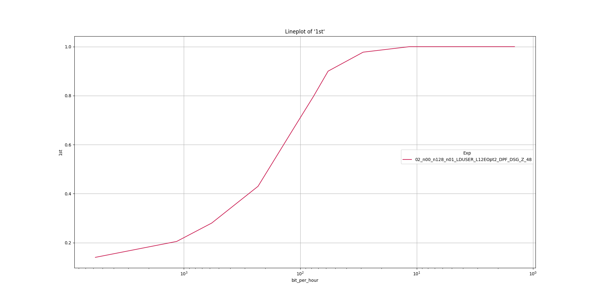

# Experiment 6
This experiments demonstrates Meltdown-Power leaking data which is only reachable by the kernel.

## Preliminary
Follow the preliminary steps of this [README.md](../README.md).

## How to Run
Execute the following command and let the script run for approximately 10 hours.

```
./run_e6.sh log.csv
```

## How to Analyze

Execute the following command to analyze the results.
```
./pp_e6.sh log.csv
```

To increase the sampling precision in the plot an optional parameter (default=100) can be specified.

Execute the following command to analyze the results with a higher *resolution*.
```
./pp_e6.sh log.csv 1000
```

## Example output
The example output for the `pp_e6.sh` script.

The resulting plot:



The resulting console output:
```
> --print 
                 1st     2nd     3rd  bit_per_minute                                           Exp  _
bit_per_hour                                                                                         
5768.149089   0.1400  0.2675  0.3600       96.135818  02_n00_n128_n01_LDUSER_L12EOpt2_DPF_DSG_Z_48  1
1153.629818   0.2050  0.3650  0.4575       19.227164  02_n00_n128_n01_LDUSER_L12EOpt2_DPF_DSG_Z_48  1
576.814909    0.2800  0.5125  0.6250        9.613582  02_n00_n128_n01_LDUSER_L12EOpt2_DPF_DSG_Z_48  1
230.725964    0.4300  0.6750  0.7875        3.845433  02_n00_n128_n01_LDUSER_L12EOpt2_DPF_DSG_Z_48  1
115.362982    0.6625  0.8525  0.9300        1.922716  02_n00_n128_n01_LDUSER_L12EOpt2_DPF_DSG_Z_48  1
76.908655     0.7975  0.9300  0.9625        1.281811  02_n00_n128_n01_LDUSER_L12EOpt2_DPF_DSG_Z_48  1
57.681491     0.9000  0.9750  0.9850        0.961358  02_n00_n128_n01_LDUSER_L12EOpt2_DPF_DSG_Z_48  1
28.840745     0.9775  1.0000  1.0000        0.480679  02_n00_n128_n01_LDUSER_L12EOpt2_DPF_DSG_Z_48  1
11.536298     1.0000  1.0000  1.0000        0.192272  02_n00_n128_n01_LDUSER_L12EOpt2_DPF_DSG_Z_48  1
5.768149      1.0000  1.0000  1.0000        0.096136  02_n00_n128_n01_LDUSER_L12EOpt2_DPF_DSG_Z_48  1
4.614519      1.0000  1.0000  1.0000        0.076909  02_n00_n128_n01_LDUSER_L12EOpt2_DPF_DSG_Z_48  1
3.845433      1.0000  1.0000  1.0000        0.064091  02_n00_n128_n01_LDUSER_L12EOpt2_DPF_DSG_Z_48  1
2.884075      1.0000  1.0000  1.0000        0.048068  02_n00_n128_n01_LDUSER_L12EOpt2_DPF_DSG_Z_48  1
1.922716      1.0000  1.0000  1.0000        0.032045  02_n00_n128_n01_LDUSER_L12EOpt2_DPF_DSG_Z_48  1
1.442037      1.0000  1.0000  1.0000        0.024034  02_n00_n128_n01_LDUSER_L12EOpt2_DPF_DSG_Z_48  1
```
